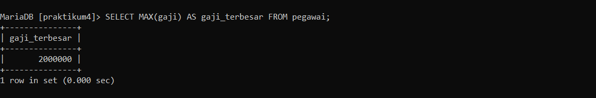
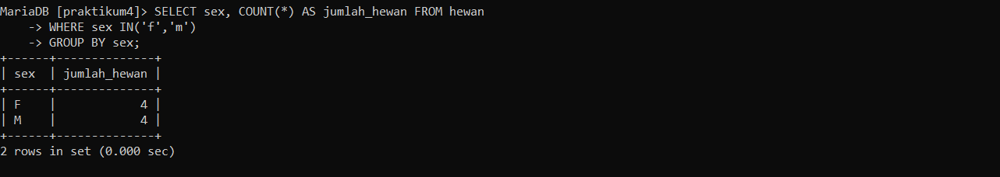

## PRAKTIKUM4_SQL

`Nama  : Faizah Via Fadhillah`

`Nim   : 312210460`

`Kelas : TI22.A4`

# Tugas Praktikum

- TABEL Pegawai


1. Tampilkan pegawai yang gajinya bukan 2.000.000 dan 1.250.000!

    Script 

    ```sql
    SELECT * FROM pegawai WHERE gaji <> 2000000 AND gaji <> 1250000;
    ```

    Output 

    

2. Tampilkan pegawai yang tunjangannya NUL!

    Script 

    ```sql
    SELECT * FROM pegawai WHERE tunjangan IS NULL;
    ```

    Output

    

3. Tampilkan pegawai yang tunjangannya tidak NULL!

    Script 

    ```sql
    SELECT * FROM pegawai WHERE tunjangan IS NOT NULL;
    ```

    Output 

    

4. Tampilkan/hitung jumlah baris/record tabel pegawai!

    Script 

    ```sql
    SELECT COUNT(*) AS jumlah_baris FROM pegawai;
    ```

    Output

    

5. Tampilkan/hitung jumlah total gaji di tabel pegawai!

    Script 

    ```sql
    SELECT SUM(gaji) AS total_gaji FROM pegawai;
    ```

    Output 

    

6. Tampilkan/hitung jumlah rata-rata gaji pegawai!

    Script 

    ```sql
    SELECT AVG(gaji) AS rata_gaji FROM pegawai;
    ```

    Output

    

7. Tampilkan gaji terkecil!

    Script 

    ```sql
    SELECT MIN(gaji) AS gaji_terkecil FROM pegawai;
    ```

    Output 

    

8.  Tampilkan gaji terbesar!

    Script 

    ```sql
     SELECT MAX(gaji) AS gaji_terbesar FROM pegawai;
    ```

    Output 

    

- TABEL Hewan


1. Tampilkan jumlah hewan yang dimiliki setiap owner!

    Script 

    ```sql
     SELECT owner, COUNT(*) AS jumlah_hewan FROM hewan GROUP BY owner;
    ```

    Output 

    

2. Tampilkan jumlah hewan berdasarkan spesies!

    Script 

    ```sql
    SELECT species, COUNT(*) AS jumlah_hewan FROM hewan GROUP BY species;
    ```

    Output

    

3. Tampilkan jumlah hewan berdasarkan jenis kelamin!

    Script 

    ```sql
    SELECT sex, COUNT(*) AS jumlah_hewan FROM hewan GROUP BY sex;
    ```

    Output 

    

4. Tampilkan jumlah hewan berdasarkan spesies dan jenis kelamin!

    Script 

    ```sql
    SELECT species,sex, COUNT(*) AS jumlah_hewan FROM hewan GROUP BY species,sex;
    ```

    Output 

    

5. Tampilkan jumlah hewan berdasarkan spesies (cat dan dog saja) dan jenis kelamin!

    Script 

    ```sql
     SELECT species, sex, COUNT(*) AS jumlah_hewan FROM hewan WHERE species IN ('Cat', 'Dog') GROUP BY species, sex;
    ```

    Output 

    

6. Tampilkan jumlah hewan berdasarkan jenis kelamin yang diketahui saja!

    Script 

    ```sql 
    SELECT sex, COUNT(*) AS jumlah_hewan FROM hewan WHERE sex IN('f','m') 
    GROUP BY sex;
    ```

    Output 

    


# Kesimpulan 

Query filtering adalah sebuah proses menyaring atau memfilter data dari basis data berdasarkan kriteria tertentu menggunakan perintah query dalam bahasa SQL. Tujuan utamanya adalah membatasi atau mengambil subset data yang sesuai dengan kondisi yang ditentukan. Dengan menggunakan query filtering ini, Kita dapat menentukan berbagai jenis kondisi seperti kesamaan `(equal)`, ketidaksamaan `(not equal)`, rentang nilai `(range)`, kondisi logis `(AND, OR)`, atau kombinasi kondisi lainnya. Dengan mengatur kondisi yang sesuai, Anda dapat mengambil hanya data yang relevan atau yang memenuhi persyaratan tertentu.


